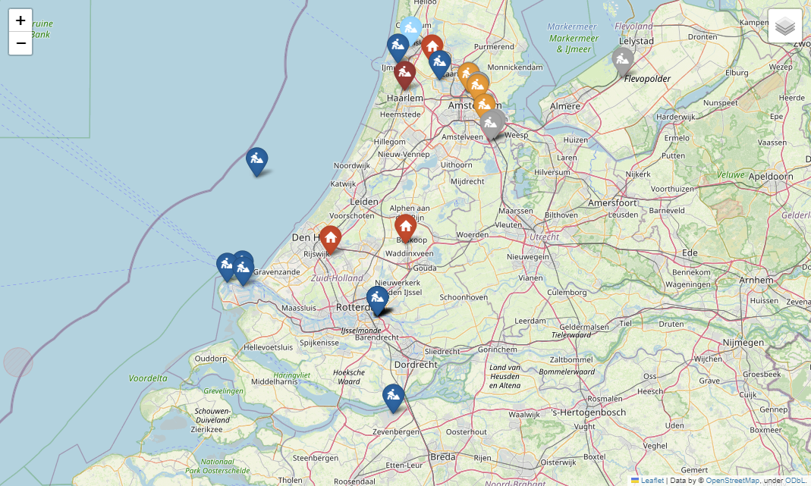

.. These are examples of badges you might want to add to your README:
   please update the URLs accordingly

    .. image:: https://api.cirrus-ci.com/github/<USER>/py-home.svg?branch=main
        :alt: Built Status
        :target: https://cirrus-ci.com/github/<USER>/py-home
    .. image:: https://readthedocs.org/projects/py-home/badge/?version=latest
        :alt: ReadTheDocs
        :target: https://py-home.readthedocs.io/en/stable/
    .. image:: https://img.shields.io/coveralls/github/<USER>/py-home/main.svg
        :alt: Coveralls
        :target: https://coveralls.io/r/<USER>/py-home
    .. image:: https://img.shields.io/pypi/v/py-home.svg
        :alt: PyPI-Server
        :target: https://pypi.org/project/py-home/
    .. image:: https://img.shields.io/conda/vn/conda-forge/py-home.svg
        :alt: Conda-Forge
        :target: https://anaconda.org/conda-forge/py-home
    .. image:: https://pepy.tech/badge/py-home/month
        :alt: Monthly Downloads
        :target: https://pepy.tech/project/py-home
    .. image:: https://img.shields.io/twitter/url/http/shields.io.svg?style=social&label=Twitter
        :alt: Twitter
        :target: https://twitter.com/py-home

.. image:: https://img.shields.io/badge/-PyScaffold-005CA0?logo=pyscaffold
    :alt: Project generated with PyScaffold
    :target: https://pyscaffold.org/

|

=======
py-home
=======

    Home built projects.

Project Map
-----------
Map with al the locations I have carried out projects.

.. _pyscaffold-notes:

Note
====

This project has been set up using PyScaffold 4.5. For details and usage
information on PyScaffold see https://pyscaffold.org/.
